Table of Contents
=================

   * [CuriePME example sketch tutorial](#curiepme-example-sketch-tutorial)
   * [Learning](#learning)
   * [Classifying](#classifying)
   * [Tutorial sketch #1: use PME to convert hex string to ASCII character](#tutorial-sketch-1-use-pme-to-convert-hex-string-to-ascii-character)
      * [Tutorial sketch #1: breakdown](#tutorial-sketch-1-breakdown)
   * [Tutorial sketch #2: use IMU data to create a more complex pattern](#tutorial-sketch-2-use-imu-data-to-create-a-more-complex-pattern)
      * [Tutorial sketch #2: breakdown](#tutorial-sketch-2-breakdown)
      * [Problem 1: There's too much data](#problem-1-theres-too-much-data)
         * [Undersampling](#undersampling)
      * [Problem 2: The data is too noisy](#problem-2-the-data-is-too-noisy)
         * [Use an averaging filter!](#use-an-averaging-filter)

This tutorial covers the use of the ``learn`` and ``classify`` functions. See
the [CuriePME API reference](https://github.com/01org/Intel-Pattern-Matching-Technology/blob/master/README.md)
for full API details.

# CuriePME example sketch tutorial

The Curie module used on the Arduino 101 board contains a Pattern Matching
Engine (PME), which is a hardware device capable of learning and recognizing
patterns in arbitrary sets of data. The DrawingInTheAir example sketch allows a
user to draw letters in the air, using their Arduino 101 board as an imaginary
pen, and can recognize which letter is being drawn by recognizing patterns in
accelerometer data from the CurieIMU library.

Don't worry if that sounds daunting. This tutorial will build the
DrawingInTheAir example from scratch, starting with a much simpler sketch. By
the end, you will understand all the individual pieces that go into the final
program, and you'll have the knowledge to start using the CuriePME library in
your own projects.

Firstly, we'll cover briefly how the PME works. We've said the PME can "learn"
and "recognize" patterns in data, but what does that mean for you, the
programmer?

All of the learning and classiying functions that the PME provides can be
controlled using the CuriePME library. Let's start with learning...

# Learning

Before the PME can be used to recognize (or "classify") any patterns, we first
have to give the PME some examples of the pattern (or patterns) we are looking
for. The CuriePME library provides the `learn()` function for this:

```cpp
 uint16_t CuriePME.learn (uint8_t vector[], int32t vector_length, uint16_t category)
```

`vector` is an array containing the data that represents our pattern. `category`
is the category that should be assigned to that pattern. So by calling
`learn()`, say for example, with a category value of 1, we are effectively
saying to the PME "Here is an example of a pattern that belongs in category 1.
If you see another pattern that looks like this, then you should know it's
category 1".

The PME is a network of 128 individual memory units, called neurons. Each neuron
can hold 128 bytes of data. Each time you call `learn()`, it writes your
pattern to a new neuron in the network. This means the maximum pattern size that
can be accepted by `learn()` (i.e. maximum value for `vector_length`) is 128 bytes,
since the entire pattern must fit inside a single neuron.

And, because we only have a certain number of neurons (128 to be exact), you
will eventually run out if you call `learn()` enough times. You can check how
many neurons have been used up using the `getComittedCount()` function, e.g.

```cpp
if (CuriePME.getComittedCount() == CuriePME.MaxNeurons) {
    /* Network is fully committed */
}
```

# Classifying

Classifying, as you may already have guessed, allows you to pass a new pattern
to the PME, and the PME will report whether the new pattern matches any of its
learned categories. The CuriePME library provides the `classify()` function for
this:

```cpp
uint16_t CuriePME.classify (uint8_t vector[], int32_t vector_length)
```

The best way to illustrate this is with a simple example sketch:

# Tutorial sketch #1: use PME to convert hex string to ASCII character

This sketch trains the PME to associate a very simple pattern with each letter
of the alphabet. The pattern for each letter is simply a string of two
ASCII characters, representing the hex digits that make up that character's
place in the ASCII table. For example, the letter 'a' has a numerical value of
decimal 97, or hex 61. So to train for the letter 'a', we will give the pattern
"61" to the PME, and indicate that it belongs in category 97. Repeat for all
letters from 'a' to 'z'.

Then, when the training is complete, users can enter strings via the Serial
monitor (e.g. "7a"), which will be written directly to the PME as a pattern to
be classified. The PME will respond with the corresponding ASCII character
(e.g. "z"). Copy-and-paste the following code into the Arduino IDE and
give it a try:

```cpp
#include "CuriePME.h"

void setup()
{
    Serial.begin(9600);
    while(!Serial);

    /* Start the PME (Pattern Matching Engine) */
    CuriePME.begin();
    trainLetters();

    Serial.println("Training complete.");

    Serial.print("Write a hex value (e.g. 6e), and the PME will return the");
    Serial.println(" corresponding ASCII character");
}

void loop ()
{
    char buf[5];
    uint8_t vector[4];
    unsigned int category;

    while (readNumFromUser(buf, 5) < 2) {
        Serial.println("Expecting 2 hex characters, e.g. 6f");
    }

    vector[0] = vector[2] = buf[0];
    vector[1] = vector[3] = buf[1];

    category = CuriePME.classify(vector, 4);

    if (category == CuriePME.noMatch) {
        Serial.println("Don't recognize that one-- try again.");
    } else {
        Serial.println(String((char)category));
    }
}

int isLineEnding (char c)
{
    return (c == '\n' || c == '\r');
}

int readNumFromUser (char buf[], int bufsize)
{
    int i = 0;
    char c;

    /* Wait for something to read */
    while (Serial.available() == 0);

    /* Read new characters into buffer until full, or until line ending is seen */
    while (Serial.available() > 0) {
        while (i < (bufsize - 1) && !isLineEnding(c = Serial.read())) {
          buf[i++] = c;
        }

        Serial.read();
    }

    buf[i] = 0;
    return i;
}

void trainLetter (const char *buf, uint8_t category)
{
    uint8_t vector[4];

    /* Write pattern twice, to ensure a large-enough distance
     between categories */
    vector[0] = vector[2] = buf[0];
    vector[1] = vector[3] = buf[1];

    CuriePME.learn(vector, 4, category);
}

void trainLetters (void)
{
    trainLetter("61", 'a');
    trainLetter("62", 'b');
    trainLetter("63", 'c');
    trainLetter("64", 'd');
    trainLetter("65", 'e');
    trainLetter("66", 'f');
    trainLetter("67", 'g');
    trainLetter("68", 'h');
    trainLetter("69", 'i');
    trainLetter("6a", 'j');
    trainLetter("6b", 'k');
    trainLetter("6c", 'l');
    trainLetter("6d", 'm');
    trainLetter("6e", 'n');
    trainLetter("6f", 'o');
    trainLetter("70", 'p');
    trainLetter("71", 'q');
    trainLetter("72", 'r');
    trainLetter("73", 's');
    trainLetter("74", 't');
    trainLetter("75", 'u');
    trainLetter("76", 'v');
    trainLetter("77", 'w');
    trainLetter("78", 'x');
    trainLetter("79", 'y');
    trainLetter("7a", 'z');
}
```

## Tutorial sketch #1: breakdown

Let's look at some parts of this sketch in detail. We had said that we were
going to read two characters from the user, and write them directly to the PME
to be classified. You may have noticed that we're not quite doing that. Here's
the function that takes the input string, something like "6f", and writes it
to the PME for learning:

```cpp
void trainLetter (const char *buf, uint8_t category)
{
    uint8_t vector[4];

    /* Write pattern twice, to ensure a large-enough distance
     between categories */
    vector[0] = vector[2] = buf[0];
    vector[1] = vector[3] = buf[1];

    CuriePME.learn(vector, 4, category);
}
```

You'll notice that the actual pattern that is passed to the `learn()` function
is double the size- 4 bytes. So we start with an input pattern like this

```cpp
contents of buf = "6f"
```

But this is what we actually write to the PME

```cpp
contents of vector[] = {'6', 'f', '6', 'f'}
```

*Why do we need to do this?*

The basic reason is that if we don't, the categories for each letter will not
be distinct enough, and we'll get unexpected results when we try to classify.

Take the first two categories, 'a' and 'b', whose patterns are "61" and "62",
respectively. Now, think about what the raw data looks like for each string;
"61", two ASCII characters '6' and '1'. So the hex representation of these two
bytes is 0x3631. Similarly, "62" is 0x3632. So there is only a difference of 1
between categories 'a' and 'b'-- this is not enough! by using that simple trick
of writing the value twice successively, e.g. 0x36313631 and 0x36323632, now
there is a much bigger difference between these two values-- 1001 to be exact.

While it's an interesting example to illustrate the basic use of the PME, this
problem we encountered would probably not occur when working with "real"
data. When larger and more complex patterns are used, patterns derived from
sensors or other real-world inputs, it is quite unlikely that there would be
such a small difference between neurons of different categories.

Now, why would you go to all this trouble just to convert some strings?
You could quite easily write some code that does the same conversion using
some simple calculations, or even by comparing the strings. The input strings
are very simple, and they never change: so it is easy to test for equality.
Either the string matches "61", and it represents 'a', or it does not match.
There's no in-between.

Indeed, this example sketch is totally overkill. The PME is designed for more
complex patterns, and we're kind of abusing it here by using it to avoid such
a simple arithmetic task.

But what if the pattern *wasn't* so simple? what if we needed, instead of a way
to test exact equality, as we so often do in everyday programming tasks, 
a way to know if something was "kind of" or "almost" equal? What if we need a
more abstract definition of equality, that is not so rigid? That is where the
real power of the PME becomes apparent. The `classify()` function lets you ask
"are these two things close enough to be considered equal?" and the `learn()`
function allows you to define what "close enough" means.

# Tutorial sketch #2: use IMU data to create a more complex pattern

**Extra hardware required**: For this sketch, you will need a button connected
to your Arduino 101 (https://www.arduino.cc/en/tutorial/pushbutton), or a shield
with a button built-in. I am using the Danger Shield from Sparkfun
(https://www.sparkfun.com/products/11649), which includes a button connected
to digital pin 10.

Now, we're going to forget about the PME for just a few minutes. We just
learned how to use the `learn()` and `classify()` functions, and you probably
want to start using them for some more interesting applications. Don't worry,
we will, but we need to move away from them for a bit and concentrate on another
piece first.

In order to use more complex patterns with the PME, we need to first analyze the
data that we have, and try to identfy the patterns ourselves. Since the
DrawingInTheAir example uses accelerometer data from the CurieIMU library, we
will start by collecting some accelerometer data.

The following sketch will wait until you press and hold the connected button,
and while the button is being held, accelerometer data is saved into a buffer
at a rate of 100Hz. That's 100 X, Y and Z values per second.

```cpp
#include "CurieIMU.h"

const unsigned int buttonPin = 12;

/* reading the accelerometer 100 times per second */
const unsigned int sampleRateHZ = 100;

void setup()
{
    Serial.begin(9600);
    while(!Serial);

    /* Set button pin as input */
    pinMode(buttonPin, INPUT);

    /* Start the IMU (Intertial Measurement Unit) */
    CurieIMU.begin();

    CurieIMU.setAccelerometerRate(sampleRateHZ);
    CurieIMU.setAccelerometerRange(4);
}

void loop ()
{
    int buf[1000];
    unsigned int numSamples = 0;

    /* Record IMU data while button is being held */
    numSamples = readFromIMU(buf, sizeof(buf));
    Serial.println("Read " + String(numSamples) + " samples from IMU");
}

unsigned int readFromIMU(int buf[], unsigned int buf_size)
{
    unsigned int i = 0;

    /* Wait until button is pressed */
    while (digitalRead(buttonPin) == HIGH);

    Serial.println("Recording motion... ");

    /* While button is being held... */
    while (digitalRead(buttonPin) == LOW) {

        /* Wait for new accelerometer data to be ready */
        if (CurieIMU.accelDataReady()) {

            /* Read the new x, y & z values into the buffer */
            CurieIMU.readAccelerometer(buf[i], buf[i + 1], buf[i + 2]);

            i += 3;

            /* If the buffer doesn't have enough space for the
             * next x, y & z values, we're finished. */
            if (i + 3 > buf_size) {
                break;
            }
        }
    }

    Serial.println("Got it!");
    return (i + 1) / 3;
}
```

## Tutorial sketch #2: breakdown

This sketch doesn't do very much right now. It reads accelerometer data into a
buffer, while the button is held, and when the button is released, we just print
the number of bytes that were read from the IMU. In order to identify any
patterns in the data, we'll need to visualize it somehow. So, I'm going to
wave my board around in the air in some specific ways, make some pretty pictures
out of the data, and let's see if we can identify some patterns.


*Note: In the graphs that follow, the x-axis represents time in terms of*
*samples recorded. Since we are sampling at 100Hz, 230 total samples*
*(for example) would mean the button was held for approximately 2.3 seconds.*

*The y-axis represents the value read from the accelerometer, which will*
*be a value between -32768 and 32767.*

**Keeping the board still & flat on my desk while holding the button**

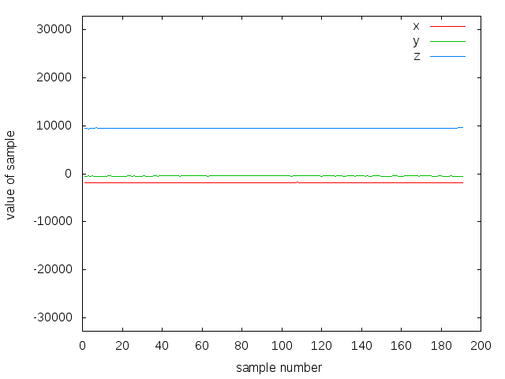


**Gently shaking the board up and down, as if shaking hands, while holding the button**

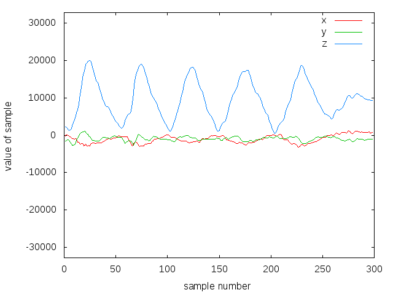


**Drawing one full circle in the air while holding the button**

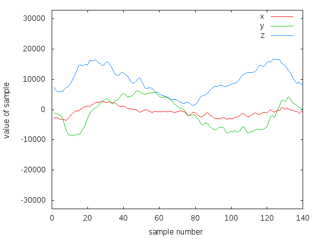


OK, so it's pretty easy to recognize the different patterns for those 3 very
different movements. Now, let's try drawing some letters (note that everybody
draws letters differently, so the following patterns will be what *my* letters
look like)


**Drawing 'A' in the air while holding the button**

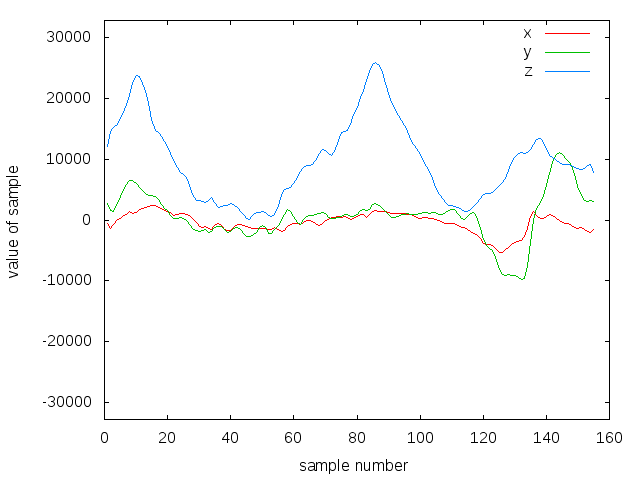


**Drawing 'B' in the air while holding the button**

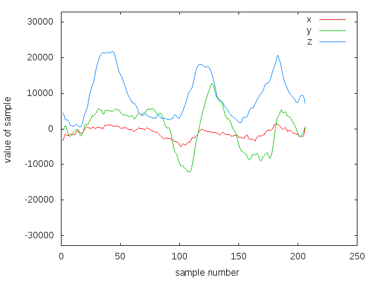


**Drawing 'C' in the air while holding the button**

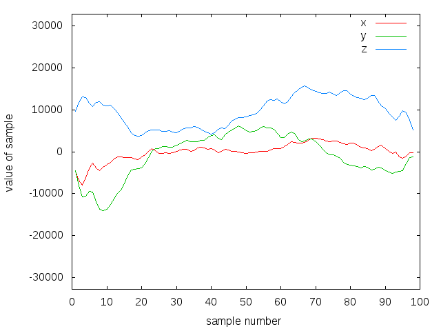


You can see that the data from drawing the letters A, B and C produce fairly
different patterns for each letter. But is it repeatable? let's try drawing
the letter A 3 times, and see if the patterns look similar:


**Drawing 'A', first time**


**Drawing 'A', second time**

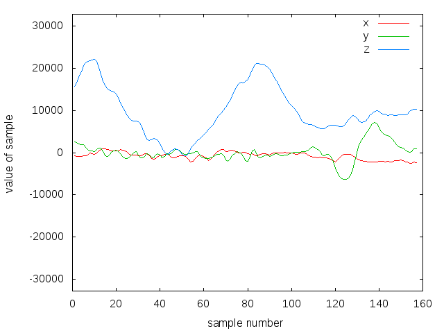


**Drawing 'A', third time**


Alright, so drawing the letter 'A' produces a pretty consistent pattern. With
the exception of some low noise and minor variations, it's easy for us to see
that those are 3 different versions of the same pattern.


So, is that it? Can we just write this data directly to the PME for training
and classification? Unfortunately, not yet. We have two big problems to solve
first. The first problem...


## Problem 1: There's too much data

As we can see from the graphs above, drawing the letter 'A' takes an average of
1.6 seconds, which is 160 samples at 100Hz. Each sample (i.e. each call to
`CurieIMU.readAccelerometer()` takes up 3 'int' values, which are 4 bytes each,
so 14 bytes per sample.

```cpp
int X, Y, Z;

/* Read raw IMU data, 14 bytes in total for all 3 values */
CurieIMU.readAccelerometer(X, Y, Z);
```

This makes for a total of 2,560 bytes that we have to capture to represent the
letter 'A', which is *way* too much. Remember that our pattern can be no larger
than 128 bytes, so we need to figure out a clever way to throw away **over 90%**
of the raw data, without destroying the original pattern.

One way we can do this is by decreasing the range of sample values. The
accelerometer returns values in the range of -32,768 to 32,767, and we are
currently using a four-byte int to store each one. This is quite a big range,
and we probably don't need such high precision for this application. So we could
map each value from the original range to 0-255, meaning it can fit in a single
byte, so we will only need 3 bytes to store a single sample of x, y and z
values. We can do this quite easily with the Arduino `map()` function:

```cpp
int X, Y, Z;
byte x, y, z;

/* Read raw IMU data, 14 bytes in total for all 3 values */
CurieIMU.readAccelerometer(X, Y, Z);

/* Map to smaller range, now 3 bytes in total for all 3 values */
x = (byte) map(X, -32768, 32767, 0, 255);
y = (byte) map(Y, -32768, 32767, 0, 255);
z = (byte) map(Z, -32768, 32767, 0, 255);
```

OK, so let's modify the ``readFromIMU()`` function from example sketch #2, to
map the X,Y and Z values from the accelerometer, and store them in a ``byte``
array instead of an ``int`` array:

```cpp
/* Use some named constants to make life easier */
const int IMULow = -32768;
const int IMUHigh = 32767;

unsigned int readFromIMU(byte buf[], unsigned int buf_size)
{
    unsigned int i = 0;
    int temp[3];

    /* Wait until button is pressed */
    while (digitalRead(buttonPin) == HIGH);

    Serial.println("Recording motion... ");

    /* While button is being held... */
    while (digitalRead(buttonPin) == LOW) {

        /* Wait for new accelerometer data to be ready */
        if (CurieIMU.accelDataReady()) {

            /* Read the new x, y & z values into the buffer */
            CurieIMU.readAccelerometer(temp[0], temp[1], temp[2]);

            buf[i]     = (byte) map(temp[0], IMULow, IMUHigh, 0, 255);
            buf[i + 1] = (byte) map(temp[1], IMULow, IMUHigh, 0, 255);
            buf[i + 2] = (byte) map(temp[2], IMULow, IMUHigh, 0, 255);

            i += 3;

            /* If the buffer doesn't have enough space for the
             * next x, y & z values, we're finished. */
            if (i + 3 > buf_size) {
                break;
            }
        }
    }

    Serial.println("Got it!");
    return (i + 1) / 3;
}
```

Now, ``readFromIMU()`` crushes each ``int`` value into a byte, and our data is
75% smaller. Have a look at the accelerometer data for drawing the letter 'A',
before and after using the ``map()`` function (notice the smaller scale on the
X-axis in the second picture- it only goes up to 255):

**Drawing the letter A, raw accelerometer data**
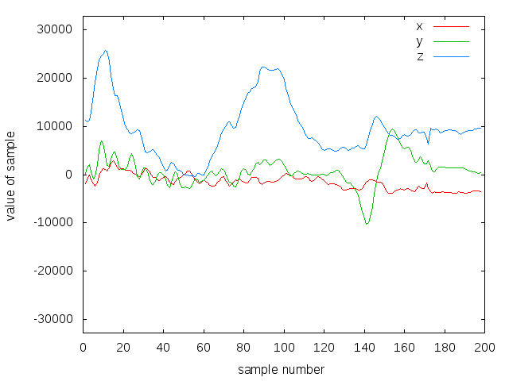

**Drawing the letter A, accelerometer data mapped to a range of 0-255**
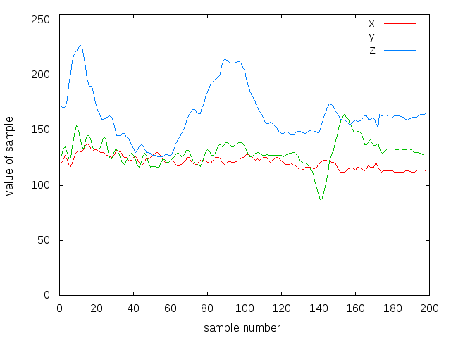

They both look the same, right? That's good news! The original pattern is still
almost completely intact, and we threw away 75% of the data. But we still have
some problems; even though each value is now 1 byte instead of 4 bytes, there is
still too much data. In the picture above showing the compressed data, we still
have 198 samples (I held the button for about 2 seconds), and given that each
sample holds one byte each for X, Y and Z, the total size of the data captured
here is 594 bytes (198 * 3 = 594). That's *still* a lot more than the 128 bytes
that we have available in a neuron!

So, what else can we do? We could compress the accelerometer values *even more*,
so each value takes up less than a byte, but that will make things really
complicated. Let's stick with 1 byte per accelerometer value, which also means
that our pattern size is limited to 42 samples, or 126 bytes (42 * 3 =
126) -- just two bytes shy of a neuron's full capacity.

To summarize, we are sampling the accelerometer at 100hz. In most cases, the
button will be held down for anywhere between 1 and 3 seconds-- possibly even
longer-- meaning ``readFromIMU()`` will usually collect 100-300 samples. But no
matter how many samples are captured, *we can only use 42 of them*. This means
we have to be smart about picking those 42 samples, which brings us to...

### Undersampling

Undersampling is pretty much what it sounds like; storing only a small number
of samples, at a lower rate than the actual sample rate. Actually, it's a bit
more than that-- Wikipedia says 

> undersampling is a technique where one samples a bandpass-filtered signal at
> a sample rate below its Nyquist rate (twice the upper cutoff frequency), 
> but is still able to reconstruct the signal

For us, this just means we'll take only the samples that we need to
accurately reproduce our pattern. To make things even simpler, we already know
that we can only take 42 samples. So we will simply stretch those 42 samples
over the entire sample window.

Taking as an example the pattern from drawing the letter 'A' in the previous
section, which was 198 samples in total, we would need to take every 4th sample
to cover the sample window with only 42 samples (198 / 42 = 4.71).

To show you what that would look like, here is the same 198 samples we saw in
the previous section, but with every 4th point highlighted, so you can get an
idea of what the final 42 samples would look like (Note that I've only
highlighted points in the Z axis, since the graph would be too crowded
otherwise. But we will of course be taking the same points from the X and Y
axes, as well):

**Drawing the letter 'A', with undersample points highlighted**

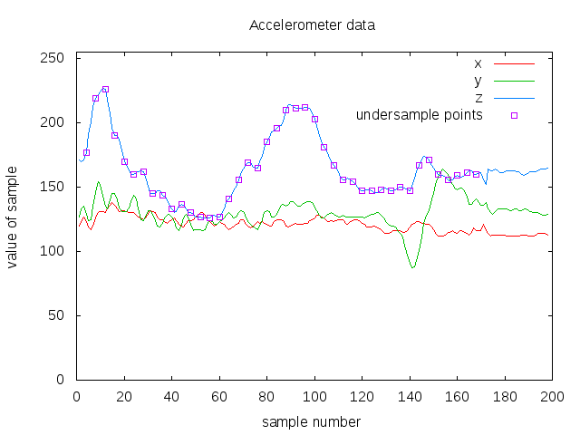

Now, we are going to write a function that does the undersampling. This function
will take the full buffer of samples, determine how many samples must be skipped
to cover the whole window with 42 samples, then iterate through the sample
buffer (skipping the calculated number of samples with every step) and place
the resulting 42 samples in an output buffer.

```cpp

/* Number of processed samples (1 sample == accel x, y, z)
 * that can fit inside a neuron */
const unsigned int samplesPerVector = (CuriePME.maxVectorSize / 3);

void undersample(byte input[], int numSamples, byte output[])
{
    unsigned int oi = 0; /* Current position in output sample buffer */
    unsigned int ii = 0; /* Current position in input sample buffer */

    /* No. of samples to skip for each iteration */
    unsigned int step = numSamples / samplesPerVector;

    for (unsigned int i = 0; i < samplesPerVector; ++i) {
        for (unsigned int j = 0; j < 3; ++j) {
            /* Cherry-pick the (ii + j)th sample from sample window */
            output[oi + j] = input[ii + j];
        }

        /* Skip 'step' samples */
        ii += (step * 3);
        oi += 3;
    }
}
```

By passing the output of ``readFromIMU()`` into this new ``undersample()``
function, we will always get 42 samples out. This brings us to the second
problem, which is...

## Problem 2: The data is too noisy

If you look back at the last graph of accelerometer data, or any of the data
graphs we've looked at so far, you'll notice that all 3 axes consist of quite
wobbly and shaky lines. The aren't smooth at all, like they might be if I'd
drawn them with a pen. In fact, in all of them, it looks like my hand is
constantly shaking.

There are a few reasons for this. First of all, all the muscles in my hand and
fingers are constantly making little movements and adjustments as I'm holding
the board-- even though it may look to me like I've moved my hand in a
straight line, the accelerometer is able to pick up a lot of little movements
that my eyes can't. Additionally, the accelerometer is not perfect, so
it will not be 100% acurate, and there will always be a little bit of noise in
the signal.

The bottom line is, these little signal anomalies will make it more difficult
for the PME to classify patterns, and we need to clean them up somehow.

### Use an averaging filter!

An [averaging filter](https://www.arduino.cc/en/tutorial/smoothing) is a simple
and effective way of "smoothing out" a data set, commonly used for streams of
ADC or accelerometer readings. I'm going to explain how we can modify the
``undersample()`` function to incorporate an averaging filter.

As was shown with the ``undersample()`` function (continuing with the same
example dataset of 198 samples), we are only taking every 4th sample from the
sample window, and throwing away the rest. But instead of throwing away the
in-between samples, we can use them! Have a look at the following lines from
the ``undersample()`` function, where we copy a sample from the ``input``
buffer to the ``output`` buffer:

```cpp
    /* Cherry-pick the (ii + j)th sample from sample window */
    output[oi + j] = input[ii + j];
```

Instead of just copying the sample as-is from the ``input`` buffer, we can
calculate the sum of this sample and the 4 skipped samples before it. Then we
take the average of these samples, to create new sample which is the average
of the previous 5 samples, and write *that* sample to the ``output`` buffer.

Now, we will write a new function called ``getAverageSample()``, which can be
used by ``undersample()`` to get an average sample:

```cpp
/* Number of processed samples (1 sample == accel x, y, z)
 * that can fit inside a neuron */
const unsigned int samplesPerVector = (CuriePME.maxVectorSize / 3);

byte getAverageSample(byte samples[], unsigned int num, unsigned int pos, unsigned int step)
{
    unsigned int ret;

    /* This is the number of samples that will be used to create each
     * average sample; i.e. all the skipped samples before and after
     * the current sample */
    unsigned int size = step * 2;

    /* Don't do any averaging, if we are at the beginning or end
     * of the sample window */
    if (pos < (step * 3) || pos > (num * 3) - (step * 3)) {
        ret = samples[pos];
    } else {
        ret = 0;
        pos -= (step * 3);

        /* Calculate the sum of 'step' samples before, and after,
         * the current sample */
        for (unsigned int i = 0; i < size; ++i) {
            ret += samples[pos - (3 * i)];
        }

        ret /= size;
    }

    return (byte)ret;
}

void undersample(byte input[], int numSamples, byte output[])
{
    unsigned int oi = 0; /* Current position in output sample buffer */
    unsigned int ii = 0; /* Current position in input sample buffer */

    /* No. of samples to skip for each iteration */
    unsigned int step = numSamples / samplesPerVector;

    for (unsigned int i = 0; i < samplesPerVector; ++i) {
        for (unsigned int j = 0; j < 3; ++j) {
            /* Get an average sample for the current position
             * in the sample window */
            output[oi + j] = getAverageSample(input, numSamples, ii + j, step);
        }

        /* Skip 'step' samples */
        ii += (step * 3);
        oi += 3;
    }
}
```


This does a pretty good job of removing the worst of the noise, while leaving
the original pattern intact. Let's compare the raw data to the final compressed,
undersampled and smoothed signal:

**Drawing 'A', raw accelerometer data (2,376 bytes in total)**


**Drawing 'A', compressed, undersampled & smoothed (126 bytes in total)**

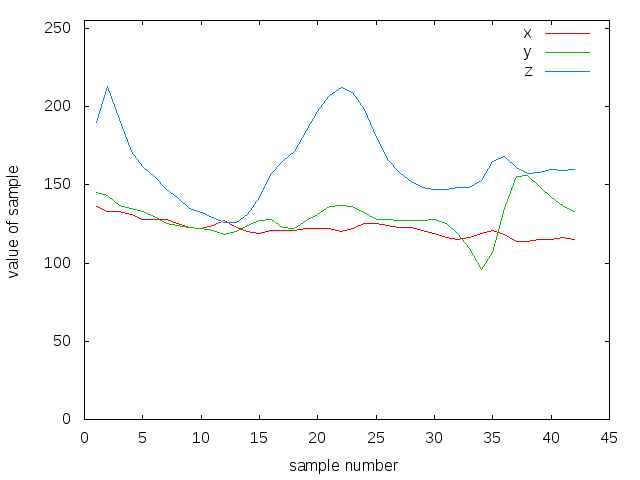

We threw away **94.7%** of the original data-- and we still have a recognizable
pattern! not bad! And now, finally, we are finished processing the data. We
have the tools that we need to turn raw accelerometer data into patterns
that the PME can learn and recognize.

As a final step for the pattern-processing part, let's modify our
``readFromIMU()`` function to use the new undersampling function on the
collected accelerometer data:

```cpp
void readFromIMU(byte vector[])
{
    byte accel[sensorBufSize];
    int raw[3];

    unsigned int i = 0;

    /* Wait until button is pressed */
    while (digitalRead(buttonPin) == LOW);

    /* While button is being held... */
    while (digitalRead(buttonPin) == HIGH) {
        if (CurieIMU.accelDataReady()) {

            CurieIMU.readAccelerometer(raw[0], raw[1], raw[2]);

            /* Map raw values to 0-255 */
            accel[i] = (byte) map(raw[0], IMULow, IMUHigh, 0, 255);
            accel[i + 1] = (byte) map(raw[1], IMULow, IMUHigh, 0, 255);
            accel[i + 2] = (byte) map(raw[2], IMULow, IMUHigh, 0, 255);

            i += 3;

            /* If there's not enough room left in the buffers
            * for the next read, then we're done */
            if (i + 3 > sensorBufSize) {
                break;
            }
        }
    }

    undersample(accel, i / 3, vector);
}
```

The rest is easy; we'll write a function called ``trainLetters()``, which
will use ``readFromIMU()`` to obtain a 126-byte pattern from the IMU.
Then, we will call ``CuriePME.learn()`` using that pattern as input
(and using letters of the alphabet as categories). Here is the code for
the ``trainLetters()`` function:

```cpp
/* This function trains a single letter, by asking the user to
 * draw it 'repeat' times */
void trainLetter(char letter, unsigned int repeat)
{
    unsigned int i = 0;

    while (i < repeat) {
        byte vector[vectorNumBytes];

        if (i) Serial.println("And again...");

        /* Read IMU data and convert to 126-byte filtered pattern */
        readFromIMU(vector);

        /* Train the PME with the pattern. Convert letter from normal ASCII
         * range (65-90) to 1-based range (1-26).
         *
         * If you don't want to do that conversion, you don't need to--
         * things will still work if the categories range from 65-90 */
        CuriePME.learn(vector, vectorNumBytes, letter - upperStart);

        Serial.println("Got it!");
        delay(1000);
        ++i;
    }
}

/* This function calls 'trainLetter()' on each letter of the alphabet */
void trainLetters()
{
    /* You can change this to 'Z', if you want... it just takes a long time
     * to train the whole alphabet. My arm gets tired :) */
    for (char i = 'A'; i <= 'F'; ++i) {
        Serial.print("Hold down the button and draw the letter '");
        Serial.print(String(i) + "' in the air. Release the button as soon ");
        Serial.println("as you are done.");

        /* Train the current letter, and prompt user to draw the
         * letter 4 times in a row */
        trainLetter(i, 4);

        Serial.println("OK, finished with this letter.");
        delay(2000);
    }
}
```

That's it! we finished the whole DrawingInTheAir example. While we did not
discuss code in the ``setup()`` and ``loop()`` functions, it should be pretty
easy to figure out, so it is left as an exercise for you.

Congratulations on making it all the way to the end of this (quite long)
tutorial; hopefully now you feel confident about using the CuriePME library
in your own projects!
